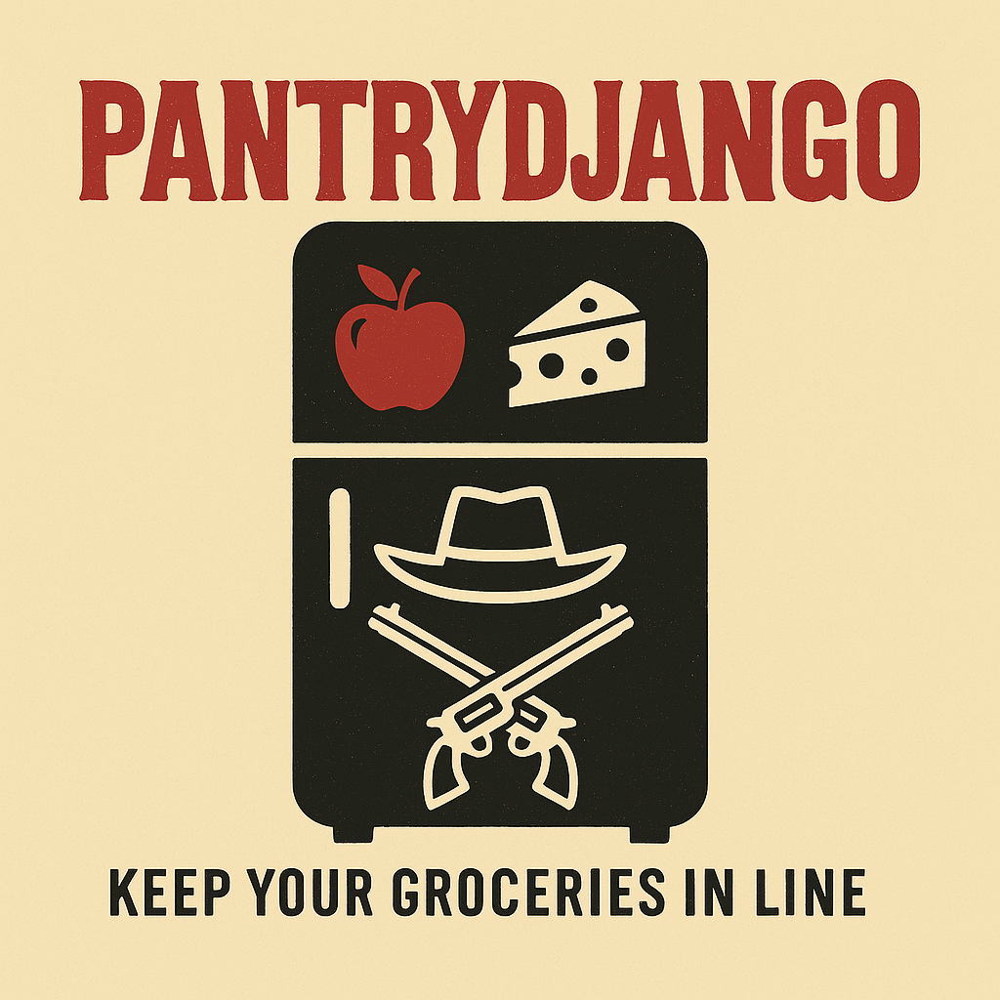
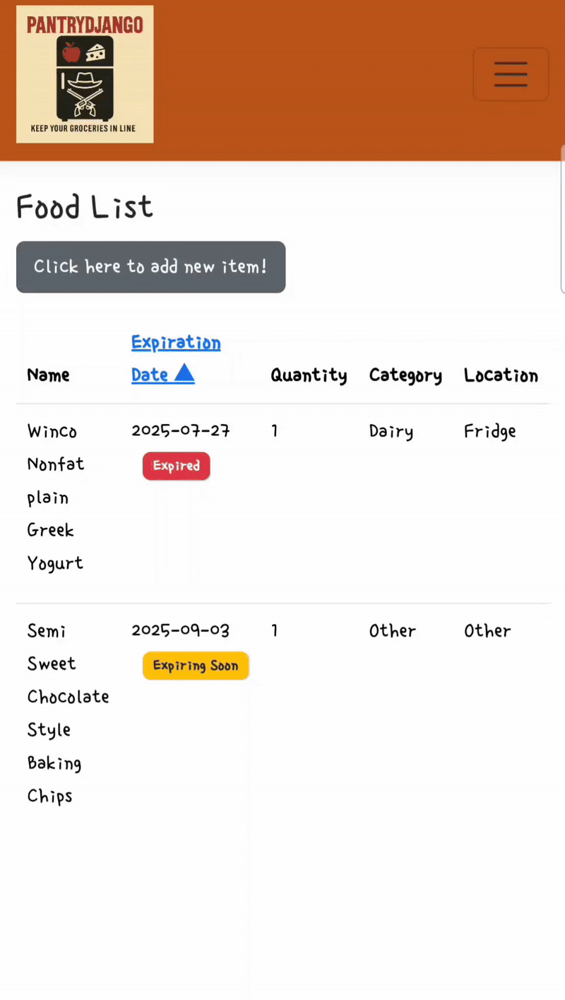

## Project Description

  

**PantryDjango** is an application that helps users keep track of the food items in their refrigerator and pantry — so they don’t miss expiration dates or waste food!  
It’s designed to reduce food waste and improve kitchen organization, making everyday life a little fresher and more efficient.

The goal of this project is to build a **practical** and **user-friendly** grocery inventory manager using **ASP.NET Core** and **Microsoft SQL Server**, with **GitHub** used for source control.

---

## Screenshots 

---

## Key Features

- **Food Inventory Management**  
  Add, edit, and delete food items with details such as name, barcode, expiration date, and quantity.

- **Barcode Scanning Integration**  
  Use your device camera to scan barcodes and automatically fetch product names via the OpenFoodFacts API.

- **OCR Expiration Date Detection**  
  Detect printed expiration dates from food package images using Tesseract OCR.

- **Expiration Date Alerts**  
  Automatically highlight items that are expiring soon or already expired to help reduce food waste.

- **Sorting and Filtering**  
  Sort items by expiration date and filter your pantry to find what you need quickly.

- **Responsive UI**  
  Designed with Bootstrap 5 to ensure a user-friendly experience on both desktop and mobile devices.

- **Azure Deployment**  
  Deployed to Azure App Service with a connected SQL Server database, supporting full CRUD operations.

---

## Technologies Used

- **ASP.NET Core** – Web Application Framework  
- **C#** – Backend Logic  
- **Microsoft SQL Server** – Relational Database  
- **Entity Framework Core** – ORM (Object-Relational Mapping)  
- **HTML / CSS / JavaScript** – Frontend  
- **Bootstrap 5** – Responsive UI Design  
- **Git & GitHub** – Version Control  
- **Tesseract OCR** – For extracting expiration dates from images  
- **ZXing.js** – For barcode scanning using device camera  
- **Azure App Service** – Web app hosting and deployment  
- **Azure SQL Database** – Cloud-hosted relational database

---

## Acknowledgements

It was inspired by my mom, who loves to keep our fridge and pantry well-stocked... maybe *a little* too well-stocked.   
The name "PantryDjango" is a playful nod to the cool Quentin Tarantino film *Django*, and also to the way "refrigerator" (냉장고) sounds in Korean.

